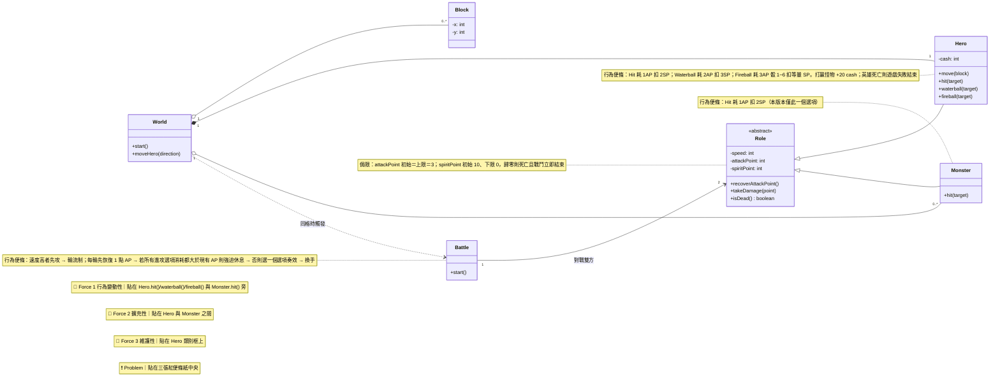
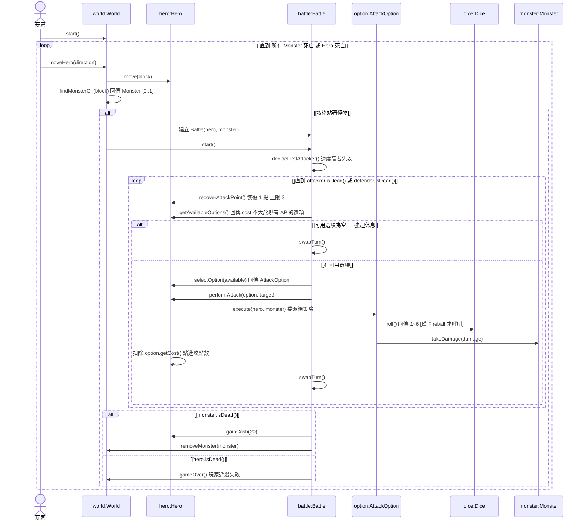
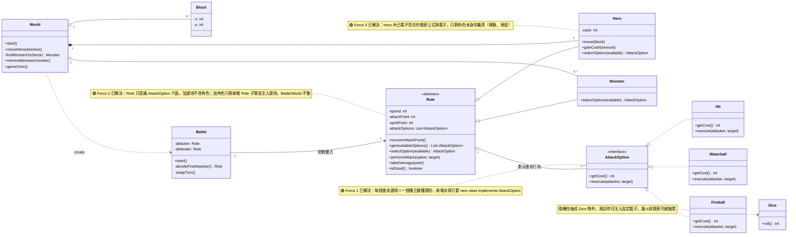

# RPG 道館挑戰 — 作答（策略模式）

> **分類：** 實戰案例 / 道館作答
> **標籤：** `#實戰` `#道館挑戰` `#策略模式` `#OOA` `#OOD` `#Forces`
> **建立：** 2026-07-29
> **題目：** [[Christopher Alexander：設計模式 道館挑戰 - RPG]]
> **模仿對象：** 課程影片「景點 - 策略模式｜基礎水平行為擴充」（逐字稿：`infra/brain-docs/course/transcripts/28-2.5-景點-策略模式_基礎水平行為擴充.md`）
> **課程章節：** Ch 2 白段道館

---

## 0. 產圖前的 Double Check：影片思路 vs 本次作答

影片明講的順序：**收到需求 → OOA 分析建模 → 撰寫初版程式碼 → 從程式碼察覺 Forces → 喊出 Problem → OOD 套設計模式 → 重構第二版 → 總結模式**。

| # | 影片的步驟 | 本作答對應 | 有做到？ |
|---|---|---|---|
| 1 | 收到需求 | §1 掃名詞／掃動詞 | ✅ |
| 2 | OOA 建模，用便條紙標註知識、用虛擬碼描述複雜行為 | §2 OOA 類別圖 + 4 張行為／侷限便條紙 | ✅ |
| 3 | 寫初版程式，用 `switch cases` 依 attackType 分歧 | §3 初版 `Role.attack()` 的 switch | ✅ |
| 4 | 察覺 Force 1 **行為變動性** | §4 Force 1（貼在進攻行為旁，紅） | ✅ |
| 5 | 察覺 Force **維護性** ＋ **擴充性** | §4 Force 2 擴充性（紅）＋ Force 3 維護性（紅） | ✅ |
| 6 | 三道 Forces 衝突 → 大聲喊出 Problem | §5 衝突點 + 一句 Problem 便條紙 | ✅ |
| 7 | OOD：**依賴反轉之重構三步驟**（封裝變動之處 → 萃取共同行為 → 委派） | §6 三步驟逐步做 | ✅ |
| 8 | **依賴注入**解決依賴 | §6.4 建構子注入 | ✅ |
| 9 | 依賴箭頭反轉、Forces 全部被解決 | §8 Forces 轉綠 + 依賴方向對照 | ✅ |
| 10 | 模式語言角色對應 Context / Strategy / ConcreteStrategy | §9 對應表 + Resulting Context | ✅ |
| 11 | 循序圖規格：抓 60% 完整度、用 loop/alt + guard、不在圖上寫扣 | §7 循序圖 | ✅ |

不照抄影片的地方只有一處，且是需求逼出來的（理由見 §6.2）：影片的 `AttackType` 介面只暴露 `attack()`，本題因為有「強迫休息判定」，介面必須額外暴露 `getCost()`。

---

## 1. OOA 第一步：掃名詞、掃動詞

**名詞 → 候選類別／屬性**

| 需求名詞 | 萃取結果 |
|---|---|
| 世界、地圖格子 | `World`、`Block` |
| 英雄、怪物、角色 | `Hero`、`Monster`、`Role`（共同抽象） |
| 戰鬥 | `Battle`（職責：定先攻、跑輪流制、結算） |
| 速度值／進攻點數／靈魂之力／現金 | `speed` / `attackPoint` / `spiritPoint` / `cash` |
| 進攻選項（撞擊、水球、火球） | 先如實掛成 Hero/Monster 的方法（**此刻不設計**） |

**動詞 → 候選操作**：移動 `Hero.move()`、觸發戰鬥 `World`、恢復點數 `Role.recoverAttackPoint()`、扣靈魂之力 `Role.takeDamage()`、判定死亡 `Role.isDead()`、獲得現金 `Hero.gainCash()`。

**侷限 (Constraints)**：`attackPoint` 初始＝上限＝3；`spiritPoint` 初始 10、下限 0；歸零即死亡且戰鬥立即結束；速度值相同時需求未定義 → 設計上明確化為「英雄先攻」。

> OOA 的心態（見 [[物件導向分析]]）：只如實描述需求，**不急著設計**。所以這張圖故意把 hit/waterball/fireball 三個方法直接開在 Hero 身上——它就是後面 Force 打下來的位置。

---

## 2. OOA 領域類別圖（含紅色 Forces 與 Problem）

**語法：Mermaid `classDiagram`**



> Astah 重畫時，上面四張 `note` 畫成**紅色便條紙**（Problem 用另一色框起來），內容用 §4／§5 的完整文字。

---

## 3. 初版程式碼：Force 是從這裡「感受」出來的

影片的做法是先寫出 switch cases，再從程式碼裡感受壓力。本題初版：

```java
abstract class Role {
    protected int speed, attackPoint = 3, spiritPoint = 10;

    void attack(String option, Role target) {
        switch (option) {                       // ← 壓力全部集中在這裡
            case "HIT":
                this.attackPoint -= 1;  target.takeDamage(2);  break;
            case "WATERBALL":
                this.attackPoint -= 2;  target.takeDamage(3);  break;
            case "FIREBALL":
                this.attackPoint -= 3;  target.takeDamage(new Random().nextInt(6) + 1); break;
        }
    }

    boolean canAttack() {                        // 強迫休息判定
        if (this instanceof Hero) return attackPoint >= 1;   // ← 角色種類也硬編碼進來了
        return attackPoint >= 1;
    }
}
```

寫到這裡就會發現兩件很痛的事：新增「冰球」要回來加一個 `case`；而 `canAttack()` 竟然要用 `instanceof` 去問「你是哪種角色」。

---

## 4. 抓 Forces（紅色便條紙文字，可直接複製到 Astah）

### 🔴 Force 1｜行為變動性 (Behavioral Variation) — 貼在進攻行為旁

> **是哪一種行為引起變動？**
> 角色的「進攻 (attack)」行為。同一個進攻動作，選 **撞擊** 是耗 1 AP／扣對方 2 SP；選 **水球** 是耗 2 AP／扣 3 SP；選 **火球** 是耗 3 AP／再骰 1~6 決定扣多少 SP——**消耗量與效果算式完全不同**。而且不同角色持有的選項集合也不同（英雄 3 種、怪物 1 種）。
>
> **未來可能會添加何等新行為？**
> 冰球（凍結對方一回合）、毒霧（往後每回合持續掉 SP）、治療（回復自身 SP）、吸血（扣對方 SP 並回自己）、暴擊（骰到 6 才生效）……；怪物升級版也會拿到水球。**每新增一種，就被迫回到 `Role.attack()` 多加一個 switch case，或在 Hero 身上多開一個方法。**

### 🔴 Force 2｜擴充性 (Extensibility) — 對應非功能需求 C

> **擴充「進攻選項」行為時，希望不必修改**：`Hero`、`Monster`、`Role`、`Battle`。（需求 C-2）
> **擴充／移除「角色」時，希望不必修改**：`Battle` 的回合流程、`World`、以及其他既有的角色類別。（需求 C-1）
> 也就是：加一個「冰球」只該多一個新檔案；加一個「弓箭手」只該多一個新檔案。

### 🔴 Force 3｜維護性 (Maintainability)

> `Hero` 是這個 RPG 最重要的類別（主角）。骰子、傷害公式、點數消耗這些**進攻細節不該塞在 Hero 裡干擾閱讀**，維護角色的工程師只想專注看「角色」本身的職責。

---

## 5. 兩道 Forces 的衝突點 → Problem

```
Force 1 說：進攻行為的種類會一直變、一直加（冰球、毒霧、治療…）
Force 2 說：它們變的時候，不准動 Hero / Monster / Role / Battle

但初版把進攻行為寫死在角色類別裡（switch case / 三個方法）
        ↓
「行為變動」的力量直接打在「不准被改」的角色類別上  ← 正面對撞
新增冰球 = 必須修改 Role.attack()，Force 2 當場爆掉
Force 3 也一起爆：Hero 被進攻細節淹沒
```

### ❗ Problem（便條紙一句話）

> **如何擴充或抽換「角色的進攻選項行為」，而完全不必修改 `Role`、`Hero`、`Monster`、`Battle` 這些既有類別？**

命中影片的策略模式 Context：「程式中定義了一組相關的演算法或行為，這些行為都不同，而且會持續改變」→ 套 [[策略模式]]。

---

## 6. OOD：依賴反轉之重構三步驟 + 依賴注入

### 6.1 第一步：封裝變動之處 (Encapsulate what varies)

每一個**行為變種 (Behavioral Variant)** 開一個類別：`Hit`、`Waterball`、`Fireball`。攻擊的具體行為（扣幾點、骰不骰）被封裝在類別內部，外部看不到。

### 6.2 第二步：萃取共同行為 (Abstract common behaviors)

三個變種的共同行為是「**某位 Role 對另一位 Role 進行一次進攻**」→ 萃取出介面 `AttackOption`：

```java
interface AttackOption {
    int  getCost();                              // 需要消耗幾點進攻點數
    void execute(Role attacker, Role target);    // 進攻的完整行為（被封裝）
}
```

**這裡是全篇唯一沒有照抄影片的地方，理由**：影片的 `AttackType` 只有 `attack()` 一個動作就夠了；但本題主需求第 3 點的「強迫休息」判定，是 `Battle` 必須**事先知道每個選項要花多少點**，才能判斷「是不是所有選項的消耗都大於現有 AP」。所以 `getCost()` 必須被抽到介面上，成為變種之間的另一個共同行為。**成本是公開的、效果是封裝的**——既滿足判定需求，又沒有洩漏傷害細節。

### 6.3 第三步：委派 (Delegation)

`Role` 不再自己實作進攻，改成持有 `List<AttackOption>`，把 `attack` 的職責委派出去：

```java
void performAttack(AttackOption option, Role target) {
    option.execute(this, target);          // 委派：我把自己當攻擊者傳進去
    this.attackPoint -= option.getCost();
}
```

### 6.4 依賴注入 (Dependency Injection)

把依賴的對象從建構子傳進去：

```java
Hero hero = new Hero(speed, List.of(new Hit(), new Waterball(), new Fireball(new Dice())));
Monster monster = new Monster(speed, List.of(new Hit()));
```

要讓怪物也會水球？改注入參數即可，`Monster` 類別一個字都不用動。

---

## 7. OOD 循序圖（套完策略模式後，回頭再梳理一次主流程）

依 [[物件導向設計]] Lesson 7 的指示：套完設計模式後要回到循序圖再梳理一次；顆粒度抓 60%，用 loop / alt + guard，不在圖上寫扣。只開一個 `option` 物件代表三種選項（同影片「只開一個玩家物件代表四位玩家」的手法）。

**語法：Mermaid `sequenceDiagram`**



這張圖同時證明設計可跑：**戰鬥主流程（`Battle`）從頭到尾只認識 `AttackOption` 介面**，永遠不需要知道打出來的是水球還是冰球。

---

## 8. OOD 類別圖（設計藍圖，Forces 已轉綠）

**語法：Mermaid `classDiagram`**



> Astah 重畫時，上面四張 note 改成**綠色便條紙**。

### 依賴方向被反轉了

```
重構前：  [角色區塊 Role/Hero/Monster]  ──依賴──▶  [進攻行為細節 hit/waterball/fireball]
重構後：  [角色區塊 Role/Hero/Monster]  ◀──依賴──  [進攻行為區塊 Hit/Waterball/Fireball]
                            ▲ 兩者中間隔著 AttackOption 介面
```

現在可以在右側區塊盡情擴充新的進攻選項，**完全不影響左側角色區塊的程式碼**——這就是三道 Forces 同時被解掉的原因。詳見 [[依賴反轉原則]]、[[開閉原則]]。

---

## 9. 模式語言對應與 Resulting Context

| 策略模式角色 | 本題對應 |
|---|---|
| **Context** | `Role`（及其子類 `Hero` / `Monster`） |
| **Strategy** | `AttackOption` 介面 |
| **ConcreteStrategy** | `Hit`、`Waterball`、`Fireball` |
| **Client** | `World` / `Main`（負責注入選項清單） |

**Resulting Context**：① 角色的進攻行為可在執行期自由抽換（怪物想學水球只改注入參數）；② 每個進攻選項封裝成獨立類別，工程師能專注維護單一選項的細節；③ 非功能需求 C-1、C-2 同時被滿足。

**兩點誠實補充（不灌水）**：

1. 「**選擇哪個進攻選項**」本身是第二道潛在的行為變動性（英雄由玩家選、怪物可能隨機選、未來 AI 可能算最佳解）。目前設計為 `Role.selectOption()` 抽象方法，由子類實作——新增角色只需一個小子類。若日後這裡也開始爆炸，再抽成 `AttackSelector` 策略即可。本題不預先套用，避免過度設計。
2. `Battle` 是否該獨立成類別可辯（也能讓 `World` 直接跑戰鬥）。獨立的理由：輪流制、先攻判定、強迫休息判定是一組完整職責，放 `World` 會讓 `World` 過胖。

---

## 10. 最終自檢：道館四項作答叮嚀逐條核對

| 道館要求 | 對應位置 | 狀態 |
|---|---|---|
| OOA 圖抓到至少一道「行為變動性」Force，擺在行為變動之處，並說明是哪種行為變動＋未來會加什麼 | §2 圖上紅便條紙、§4 Force 1 | ✅ |
| OOA 圖抓到一道「擴充性」Force，說明擴充什麼行為時不必改哪些類別 | §4 Force 2 | ✅ |
| 抓兩道 Forces 的衝突點，總結成一句 Problem 便條紙 | §5 | ✅ |
| OOD 套設計模式解決 Problem，已解決的 Forces 改成綠色 | §6 三步驟＋DI、§8 三張綠便條紙 | ✅ |
| 三張交付圖 | §2 OOA 領域類別圖、§7 OOD 循序圖、§8 OOD 類別圖 | ✅ |

**上傳前要做的事**：道館只收 png/jpg/bmp/gif。三段 Mermaid 可貼到 mermaid.live 匯出 PNG；但要拿到道館要求的**紅／綠便條紙**，建議用 Astah 依這三張圖重畫，把 §4 的三段文字貼成紅色 note、§8 的三段貼成綠色 note。

---

## 相關概念

- [[Christopher Alexander：設計模式 道館挑戰 - RPG]] — 本作答對應的題目與方法論筆記
- [[策略模式]] — 本作答套用的模式
- [[依賴反轉原則]] — 重構三步驟的本質
- [[開閉原則]] — Force 2 的原則名稱
- [[物件導向分析]] — OOA 建模技法（掃名詞／掃動詞／侷限）
- [[物件導向設計]] — OOD 流程（先求跑再求好、循序圖）
- [[水球流OADP]] — 整體疊代框架

---

## 反向連結

- [[Christopher Alexander：設計模式 道館挑戰 - RPG]] — 題目頁
- [[策略模式]] — 首次實戰套用
