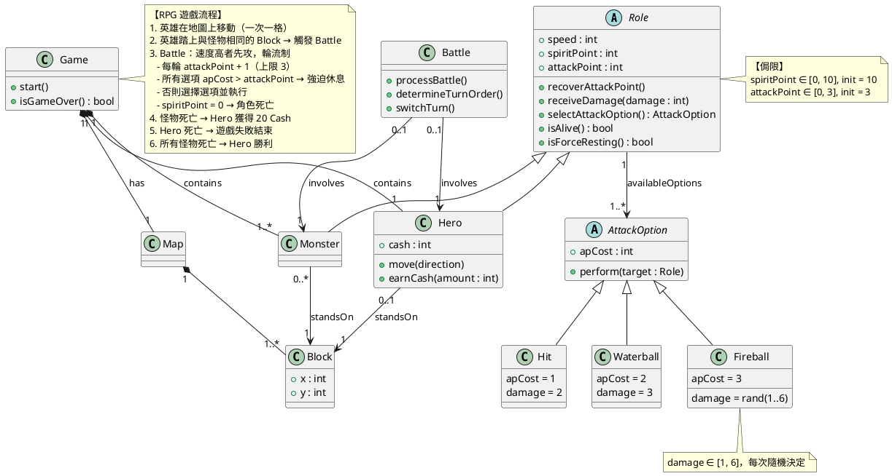

先標示本次使用的 SOP 框架，然後一句一句走。

---

## OOA SOP 三步驟（每句都要走）

```
每讀一句需求
  │
  ▼
Step 1【點萃取】
  詞彙是否可實際存在的實體？
  ├─ 否 → 屬性 → 歸屬到哪個類別？
  └─ 是 → 抽象分類 → Class
          唯一個體  → Object → 歸入 Class
  │
  ▼
Step 2【區分結構、行為、侷限】
  職責 / 屬性 / 行為 / 互動（→衍生操作）/ 侷限
  │
  ▼
Step 3【線萃取】
  關係是否存在於行為之外？
  ├─ 否 → 依賴 (Dependency)
  └─ 是 → IS-A → 繼承
           HAS-A → 關聯 → 分析兩端基數
                          → 若關聯本身有屬性/行為 → 升為關聯類別
```

---

## 句 1：「遊戲中玩家將控制著一個主角英雄 (Hero)」

### Step 1 點萃取

|詞彙|可實際存在的實體？|抽象分類 or 唯一個體？|結論|
|---|---|---|---|
|RPG 遊戲|✅ 是|抽象分類（遊戲這個概念）|**Class: `Game`**|
|玩家|✅ 是|→ Step 2 分析後全空|**略過（系統外部 Actor）**|
|英雄 (Hero)|✅ 是|唯一個體（"一個主角"）|**Object: `:hero` → Class: `Hero`**|

> **玩家為何略過？** Step 2 問職責/屬性/行為/互動 → 四項全空。系統不追蹤任何玩家資訊，Hero 就是玩家在系統內的唯一代理。

### Step 2 結構/行為/侷限

- **Game 職責**：管理整個 RPG 遊戲的進行
- **Hero 職責**：代表玩家在遊戲世界中行動的角色

### Step 3 線萃取

| 關係          | 行為之外存在？          | IS-A / HAS-A | 兩端基數                        | 結論                                      |
| ----------- | ---------------- | ------------ | --------------------------- | --------------------------------------- |
| Game ↔ Hero | ✅ 是（Hero 不隨行為消失） | HAS-A        | Game視角：1 Hero；Hero視角：1 Game | **Composition `Game "1" *── "1" Hero`** |

> **為何是 Composition？** Hero 離開 Game 沒有意義，無法獨立存在。

**✅ 新增：** `class Game`、`class Hero`、`Game "1" *── "1" Hero`

---

## 句 2：「英雄的目的是要殺死所有的怪物 (Monster)」

### Step 1 點萃取

|詞彙|可實際存在的實體？|抽象分類 or 唯一個體？|結論|
|---|---|---|---|
|怪物 (Monster)|✅ 是|抽象分類（"所有的怪物"）|**Class: `Monster`**|

### Step 2 結構/行為/侷限

- **Monster 職責**：英雄必須打倒的敵人
- **侷限（遊戲流程）**：英雄目的 = 殺死所有怪物 → 勝利條件（記入便條紙）

### Step 3 線萃取

|關係|行為之外存在？|IS-A / HAS-A|兩端基數|結論|
|---|---|---|---|---|
|Game ↔ Monster|✅ 是|HAS-A|Game視角：1..* Monster；Monster視角：1 Game|**Composition `Game "1" *── "1..*" Monster`**|

> **Hero ↔ Monster 在此句要加線嗎？** 不加。"殺死"是目標描述，實際的互動關係等到「觸發戰鬥」的句子再處理。

**✅ 新增：** `class Monster`、`Game "1" *── "1..*" Monster`

---

## 句 3：「英雄可以自由地在這個世界中移動，一次移動一個地圖格子 (Block)」

### Step 1 點萃取

|詞彙|可實際存在的實體？|抽象分類 or 唯一個體？|結論|
|---|---|---|---|
|這個世界|✅ 是|抽象分類（地圖概念）|**Class: `Map`**|
|地圖格子 (Block)|✅ 是|唯一個體（一個一個格子）|**Object → Class: `Block`**|

### Step 2 結構/行為/侷限

- **Map 職責**：代表遊戲世界，由格子組成
- **Block 職責**：英雄與怪物移動和站立的最小單位
- **行為**：`Hero.move(direction)` — 英雄移動的業務行為

### Step 3 線萃取

|關係|行為之外存在？|IS-A / HAS-A|兩端基數|結論|
|---|---|---|---|---|
|Game ↔ Map|✅ 是|HAS-A|1 Game : 1 Map|**Composition `Game "1" *── "1" Map`**|
|Map ↔ Block|✅ 是|HAS-A|1 Map : 1..* Block|**Composition `Map "1" *── "1..*" Block`**|
|Hero ↔ Block|✅ 是（英雄隨時都站在某格）|HAS-A|Block視角：0..1 Hero（多數格沒有英雄）；Hero視角：1 Block|**Association `Hero "0..1" --> "1" Block : standsOn`**|

**✅ 新增：** `class Map`、`class Block`、三條關聯、`Hero.move()`

---

## 句 4：「每當英雄與某隻怪物站在同一個格子上，就會觸發英雄與怪物之間的戰鬥」

### Step 1 點萃取

|詞彙|可實際存在的實體？|抽象分類 or 唯一個體？|結論|
|---|---|---|---|
|戰鬥 (Battle)|✅ 是|抽象分類（每次都是一場新戰鬥）|**Class: `Battle`**|

> **為何 Battle 是 Class 而不只是行為？** 它有自己的職責（管理戰鬥流程）、有持續時間、涉及多個實體、有自己的行為（決定先攻、輪流）。符合「有唯一職責的實體」的定義。

### Step 2 結構/行為/侷限

- **Battle 職責**：管理英雄與怪物之間一場完整的戰鬥
- **侷限（觸發條件）**：Hero 與 Monster 站在同一 Block → 觸發 Battle

### Step 3 線萃取

|關係|行為之外存在？|IS-A / HAS-A|兩端基數|結論|
|---|---|---|---|---|
|Monster ↔ Block|✅ 是|HAS-A|Block視角：0..* Monster；Monster視角：1 Block|**Association `Monster "0..*" --> "1" Block : standsOn`**|
|Battle ↔ Hero|✅ 是（Battle 存在期間始終關聯 Hero）|HAS-A|Hero視角：0..1 Battle（可能不在戰中）；Battle視角：1 Hero|**Association `Battle "0..1" --> "1" Hero : involves`**|
|Battle ↔ Monster|✅ 是|HAS-A|Monster視角：0..1 Battle；Battle視角：1 Monster|**Association `Battle "0..1" --> "1" Monster : involves`**|

**✅ 新增：** `class Battle`、`Monster.standsOn`、兩條 Battle 關聯、觸發侷限

---

## 句 5：「英雄與怪物這兩種角色 (Role) 都有一個速度值 (Speed)」

### Step 1 點萃取

|詞彙|可實際存在的實體？|抽象分類 or 唯一個體？|結論|
|---|---|---|---|
|角色 (Role)|✅ 是|抽象分類（"這兩種"說明是共同父概念）|**Abstract Class: `Role`**|
|速度值 (Speed)|❌ 否（是描述角色的值）|—|**Attribute: `Role.speed : int`**|

> **為何 Role 是抽象類別？** 需求說「這兩種角色」，明確告知 Hero 和 Monster 共享同一個分類概念。你永遠不會有一個「純粹的 Role 個體」，只會有 Hero 或 Monster。

### Step 2 結構/行為/侷限

- **Role 職責**：定義 Hero 和 Monster 共有的特性與行為
- **屬性**：`speed : int`

### Step 3 線萃取

|關係|行為之外存在？|IS-A / HAS-A|兩端基數|結論|
|---|---|---|---|---|
|Hero ↔ Role|—|IS-A（Hero 是一種 Role）|—|**Generalization `Role <\|── Hero`**|
|Monster ↔ Role|—|IS-A（Monster 是一種 Role）|—|**Generalization `Role <\|── Monster`**|

**✅ 新增：** `abstract class Role`、`speed: int`、兩條繼承

---

## 句 6：「進攻採輪流制；進攻時根據不同的進攻選項，會消耗不同數量的進攻點數 (Attack Point)」

### Step 1 點萃取

|詞彙|可實際存在的實體？|抽象分類 or 唯一個體？|結論|
|---|---|---|---|
|進攻選項|✅ 是（需求明確命名，且有屬性和行為）|抽象分類（多種不同選項）|**Abstract Class: `AttackOption`**|
|進攻點數 (Attack Point)|❌ 否（描述角色的資源值）|—|**Attribute: `Role.attackPoint : int`**|
|消耗的點數（apCost）|❌ 否（描述選項的屬性）|—|**Attribute: `AttackOption.apCost : int`**|

### Step 2 結構/行為/侷限

- **AttackOption 職責**：封裝一種可選的進攻行為，定義消耗成本與效果
- **Battle 行為**：`determineTurnOrder()` — 速度高者先攻；`switchTurn()` — 輪流換邊

### Step 3 線萃取

|關係|行為之外存在？|IS-A / HAS-A|兩端基數|結論|
|---|---|---|---|---|
|Role ↔ AttackOption|✅ 是（角色隨時持有其可用選項，不只在進攻時）|HAS-A|AttackOption視角：1 Role（每個選項實例屬於特定角色）；Role視角：1..* AttackOption|**Association `Role "1" --> "1..*" AttackOption : availableOptions`**|

**✅ 新增：** `abstract class AttackOption`、`attackPoint/apCost 屬性`、Role→AttackOption 關聯、Battle 兩個行為

---

## 句 7：「輪到時 AP 恢復 1 點；所有選項 apCost > AP → 強迫休息」

### Step 1 點萃取

無新詞彙。

### Step 2 結構/行為/侷限

- **行為**：`Role.recoverAttackPoint()` — 每輪 AP +1
- **行為/查詢**：`Role.isForceResting() : bool` — 判斷是否強迫休息
- **侷限**：所有選項的 `apCost > attackPoint` → 強迫休息，跳過本輪

**✅ 新增：** `recoverAttackPoint()`、`isForceResting()` on Role、強迫休息侷限

---

## 句 8：「角色要選自己的進攻選項；每個選項效果大有不同，奏效後換對方」

### Step 1 點萃取

無新詞彙。

### Step 2 結構/行為/侷限

- **行為**：`Role.selectAttackOption() : AttackOption` — 選擇要使用的選項
- **行為**：`AttackOption.perform(target : Role)` — 執行選項效果

**互動分析**：`perform()` 的效果是「減少 target 的 spiritPoint」  
→ 這個互動要求 Role 必須提供一個讓 AttackOption 呼叫的操作  
→ **衍生操作：`Role.receiveDamage(damage : int)`**

**✅ 新增：** `selectAttackOption()` on Role、`perform(target: Role)` on AttackOption、`receiveDamage()` on Role（由互動衍生）

---

## 句 9：「英雄打贏怪物，英雄獲得 20 點現金 (Cash)」

### Step 1 點萃取

|詞彙|可實際存在的實體？|抽象分類 or 唯一個體？|結論|
|---|---|---|---|
|現金 (Cash)|❌ 否（描述 Hero 持有的資源值）|—|**Attribute: `Hero.cash : int`**|

### Step 2 結構/行為/侷限

- **屬性**：`cash : int` 在 Hero（只有英雄有現金，Monster 沒有）
- **行為**：`Hero.earnCash(amount : int)`
- **侷限**：怪物死亡 → `Hero.earnCash(20)`

**✅ 新增：** `cash : int`、`earnCash()` on Hero、獲得現金侷限

---

## 額外描述 1：「每個角色初始/最多進攻點數 = 3 點」

### Step 2 侷限

- **侷限**：`attackPoint ∈ [0, 3]`，init = 3

**✅ 新增：** attackPoint 範圍侷限

---

## 額外描述 2：「靈魂之力 (Spirit Point) 初始 10，最低 0，歸零 → 死亡；英雄死亡 → 遊戲失敗」

### Step 1 點萃取

|詞彙|可實際存在的實體？|抽象分類 or 唯一個體？|結論|
|---|---|---|---|
|靈魂之力 (Spirit Point)|❌ 否（描述角色的生命值）|—|**Attribute: `Role.spiritPoint : int`**|

### Step 2 結構/行為/侷限

- **行為/查詢**：`Role.isAlive() : bool`
- **侷限**：`spiritPoint ∈ [0, 10]`，init = 10
- **侷限**：`spiritPoint = 0` → 死亡 → Battle 立即結束
- **侷限**：Hero 死亡 → Game Over

**✅ 新增：** `spiritPoint : int`、`isAlive()` on Role、SP 相關侷限

---

## B 進攻選項：Hit / Waterball / Fireball / Monster's Hit

### Step 1 點萃取

|詞彙|可實際存在的實體？|抽象分類 or 唯一個體？|結論|
|---|---|---|---|
|撞擊 (Hit)|✅ 是|抽象分類（可多次使用）|**Class: `Hit`**|
|水球攻擊 (Waterball)|✅ 是|抽象分類|**Class: `Waterball`**|
|火球攻擊 (Fireball)|✅ 是|抽象分類|**Class: `Fireball`**|
|Monster 的撞擊|✅ 是|與 Hero 的 Hit 同一概念|**同 Class: `Hit`（不重複建立）**|

### Step 2 結構/行為/侷限

|類別|職責|屬性|侷限|
|---|---|---|---|
|Hit|消耗 1 AP，扣對手 2 SP|apCost=1, damage=2|—|
|Waterball|消耗 2 AP，扣對手 3 SP|apCost=2, damage=3|—|
|Fireball|消耗 3 AP，隨機傷害|apCost=3, damage=rand(1..6)|`damage ∈ [1,6]`|

### Step 3 線萃取

|關係|IS-A / HAS-A|結論|
|---|---|---|
|Hit IS-A AttackOption|IS-A|**Generalization `AttackOption <\|── Hit`**|
|Waterball IS-A AttackOption|IS-A|**Generalization `AttackOption <\|── Waterball`**|
|Fireball IS-A AttackOption|IS-A|**Generalization `AttackOption <\|── Fireball`**|

> 「不同種角色有不同的進攻選項」再次確認 `Role "1" --> "1..* "AttackOption` 關聯正確；同時暗示 Hero 的 availableOptions = {Hit, Waterball, Fireball}，Monster = {Hit}。

**✅ 新增：** 三個具體 AttackOption 類別及其繼承關係

---

## 最終 OOA 領域類別圖（PlantUML 語法）

